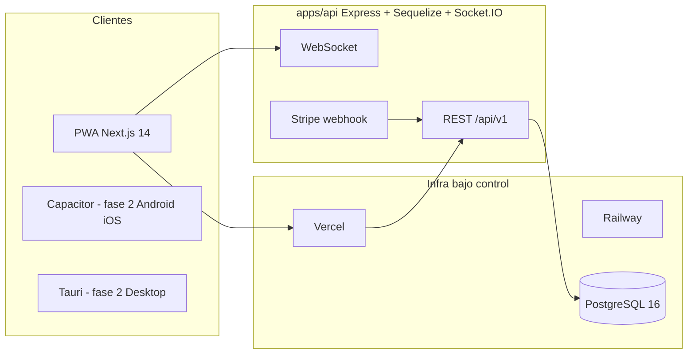
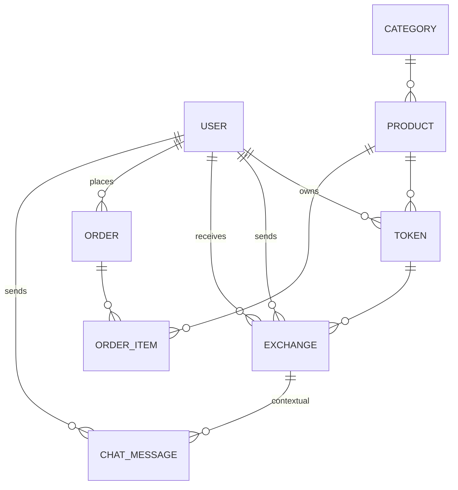
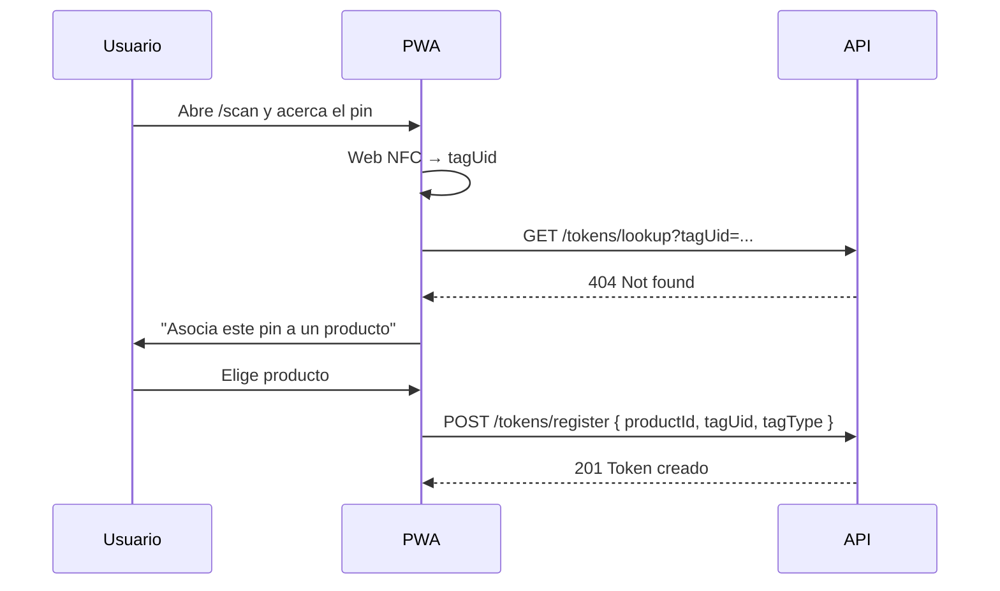

# Arquitectura Zero NPC

## Visión general

Zero NPC es una **PWA mobile-first** cuya funcionalidad central es asociar tokens digitales a productos físicos mediante **pines NFC** (o QR como fallback) y permitir intercambiarlos entre usuarios. Alrededor del núcleo se construye una tienda con Stripe, mensajería en tiempo real y autenticación con email + OTP.

## Diagrama de alto nivel

## Capas

- **`apps/web`** — Next.js 14 App Router, Tailwind, Redux Toolkit, Socket.IO client, Axios. Estructura por feature (`src/app/*`) con Providers globales.
- **`apps/api`** — Express 4, Sequelize 6 (PostgreSQL), Socket.IO 4, JWT, Zod, Stripe. Estructura modular (`src/modules/<feature>/{schemas,service,controller,routes}.js`).
- **`packages/shared`** — Constantes y validadores Zod compartidos.
- **`packages/config`** — Configs base ESLint/TS.

## Modelo de datos principal

### Entidades clave

| Entidad      | Notas                                                                                          |
| ------------ | ---------------------------------------------------------------------------------------------- |
| `User`       | `tokenCharges`, `lastChargeResetAt`, `role`, OTPs de verificación y reset.                      |
| `Product`    | `isPin` diferencia pines NFC de productos físicos de tienda.                                   |
| `Token`      | Unidad intercambiable. `tagUid` único, `currentOwnerId`, `exchangeCount`, `isLocked`.          |
| `Exchange`   | Estados: `pending → accepted → validated` (o `rejected`/`cancelled`/`expired`).                |
| `Order`      | Integra con Stripe Checkout Session + webhook.                                                 |
| `ChatMessage`| Mensajería 1:1 con `exchangeId` opcional para contexto.                                        |

## Flujos principales

### 1. Registrar un pin NFC

### 2. Intercambio de token

Ver `docs/nfc-guide.md` para el detalle completo incluyendo casos de cancelación y expiración.

## Seguridad en una página

- Helmet, rate-limit, CORS estricto, JWT con rotación, validación Zod, bcrypt 12 rounds, Stripe webhook con firma, redacción de secretos en logs, locks de fila en el intercambio.

## Fases futuras

| Fase | Alcance                                                                                        |
| ---- | ---------------------------------------------------------------------------------------------- |
| 2a   | Capacitor wrapper Android + iOS. Sustituir `src/lib/scanner.js` por `@capacitor-community/nfc`.|
| 2b   | Tauri v2 para desktop (reuso de la PWA buildada).                                             |
| 3    | Gamificación, comunidad (posts), notificaciones push via service worker.                      |
| 4    | Admin panel (`apps/admin`), métricas y observabilidad (Sentry, OpenTelemetry).                |
