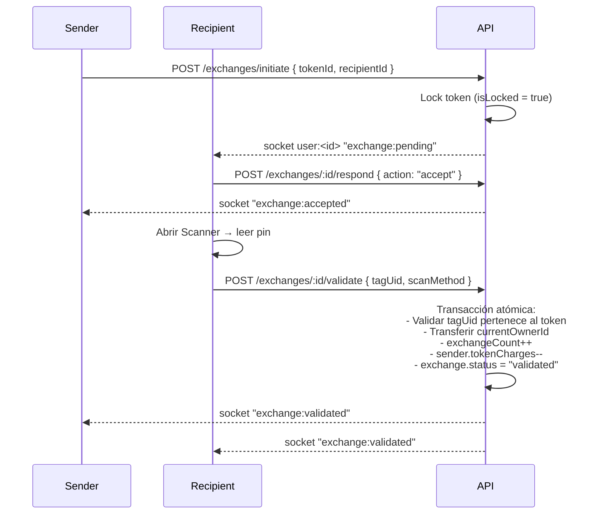

# Guía NFC / QR

Zero NPC usa pines NFC físicos como principal medio de autenticación de pertenencia de productos. El QR actúa como fallback.

## Matriz de soporte (MVP)

| Plataforma                   | NFC lectura | NFC escritura | QR cámara | Estrategia MVP         |
| ---------------------------- | ----------- | ------------- | --------- | ---------------------- |
| Chrome/Edge Android          | ✅ Web NFC  | ✅ Web NFC    | ✅         | NFC por defecto        |
| Safari iOS (≥15)             | ❌          | ❌            | ✅         | QR (fallback)          |
| Chrome iOS                   | ❌          | ❌            | ✅         | QR (fallback)          |
| Desktop Chrome/Edge/Safari   | ❌          | ❌            | ✅ (webcam)| QR                     |

Reservar una abstracción estable (`apps/web/src/lib/scanner.js`) permite sustituir la implementación en fase 2 por:

| Plataforma        | Fase 2                                      |
| ----------------- | ------------------------------------------- |
| Capacitor iOS     | `@capacitor-community/nfc` (Core NFC)       |
| Capacitor Android | `@capacitor-community/nfc` (NFC HCE + tags) |
| Tauri Desktop     | Plugin propio (solo QR relevante)           |

## Formato de datos en el pin

- **UID del tag** (NFC/NDEF `serialNumber`) — recomendado como valor canónico; es único e inmutable.
- **NDEF text record** — opcional, para poder leer desde apps genéricas (ej. `z/npc/<tagId>`).
- **QR code** — contiene el mismo valor que `tagUid` para unificar el flujo.

La columna `tokens.tag_uid` tiene un `UNIQUE` constraint: registrar un mismo UID dos veces devuelve `409 Conflict`.

## Flujo completo de intercambio

### Estados

- `pending` — creado por sender.
- `accepted` — recipient aceptó (tiene hasta `expiresAt` para escanear).
- `validated` — recipient escaneó el pin correcto; token cambia de dueño.
- `rejected` — recipient declinó.
- `cancelled` — sender canceló mientras estaba `pending`/`accepted`.
- `expired` — se alcanzó `expiresAt` sin validar.

### Concurrencia

`exchanges.service.validate()` abre una transacción con `SELECT ... FOR UPDATE` sobre `exchanges` y `tokens` para impedir dobles validaciones.

## Pruebas manuales recomendadas

1. **Android**: registrar un pin, transferirlo a un segundo usuario, verificar que el armario refleja el cambio.
2. **iOS**: reutilizar el mismo pin pero escanear vía QR (la app imprime un QR con el mismo UID) y validar.
3. **Sin cobertura**: intentar iniciar un intercambio con `tokenCharges = 0` → debe devolver `400`.
4. **Concurrencia**: dos recipients hipotéticos validando el mismo exchange → uno obtiene `400 Exchange is validated`.

## Problemas conocidos

- Web NFC requiere HTTPS (en desarrollo local usar `mkcert` o probar con Chrome por USB a puerto remoto seguro).
- Safari iOS requiere un gesto del usuario para lanzar la cámara, por eso el QR scanner se inicia cuando el usuario pulsa la pestaña.
